# DOSW_BITACORA

# SEMANA No 1 - DOSW Manejo de Streams
## Datos personales:
- Nombre y Apellido: Juan Garzón
- Codigo de Estudiante: 1000103731
- Curso: DOSW - 4

---

## Ejercicio 01 - Números Pares mayores a diez 

Dada una lista de números enteros, necesitamos obtener una nueva lista solo con los números pares mayores a 10.

**Código implementado:** 
```
public class Ejercicio1 {
    public static void main(String[] args) {
        Entrada1 entrada = new Entrada1();
        List<Integer> numeros = entrada.leerLista();
        List<Integer> resultado = numeros.stream().filter(n -> n%2==0 && n>10).toList();
        System.out.println(resultado);
    }
}
```
**Captura de ejecucion:** 

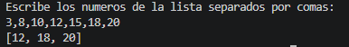

**Explicación:** Creamos una clase para la manejar la entrada. Y con stream recorremos la lista de los números ingresados y usamos el metodo `filter()` para poder realizar el filtro de los números pares mayores a 10, con la condición `n%2==0` para obtener los números pares y la condición `n > 10` para que sean mayores a 10

## Ejercicio 02 - Cantidad de Palabras con más de 4 caracteres

Dada una lista de palabras, se requiere: 

- Filtrar las palabras que tengan más de 4 caracteres 
- Convertirlas en Mayúsculas 
- Ordenarlas alfabéticamente
- Obtener la cantidad total de palabras resultantes 

**Código implementado:**
```
public class Ejercicio2 {
    public static void main(String[] args) {
        Entrada2 entrada = new Entrada2();
        List<String> palabras = entrada.leerLista();
        long palabrasResultantes = palabras.stream()
                                           .filter(n -> n.length() > 4)
                                           .map(String::toUpperCase)
                                           .sorted()
                                           .count();
        System.out.println("Cantidad de palabras resultantes: "+palabrasResultantes);
    }
}
```
**Captura de ejecucion:**

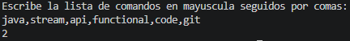

**Explicación:** Creamos una clase para manejar la entrada, y con stream recorremos la lista de las palabras ingresadas. Usando el metodo `filter()` para poder filtrar las palabras con más de 4 caracteres, con la condición `n.legth() > 4`. Usando el metodo `map()` convertimos las palabras en máyusculas usando `String::toUpperCase` que es un metodo de la clase String. Usamos el metodo `sorted()` para ordenarlas alfabeticamente, no es necesario agregarle un parametro ya que por defecto ordena por orden alfabetico. Por ultimo el metodo `count()`, para la cantidad total de palabras resultantes.

## Ejercicio 03 - Obtener nombres de los Usuarios 

Dada una lista de usuarios con los atributos: id, name, age, active 

Filtra únicamente los usuarios activos, obtén una lista con los nombres en mayúscula y ordenada alfabéticamente.

**Código implementado:**
```
public class Ejercicio3 {
    public static void main(String[] args) {
        List<User> users = Arrays.asList(
                new User("1", "Carlos", 20, true),
                new User("2", "Ana", 22, false),
                new User("3", "Miguel", 19, true),
                new User("4", "Sofia", 25, true),
                new User("5", "Daniel", 21, false),
                new User("6", "Laura", 23, true)
        );
        List<String> sortedUsers = users.stream()
                                        .filter(User::isActive)
                                        .map(User::getName)
                                        .map(String::toUpperCase)
                                        .sorted()
                                        .toList();
        System.out.println("Usuarios activos, ordenados alfabeticamente: ");
        System.out.println(sortedUsers);
    }
}
```
**Captura de ejecucion:**

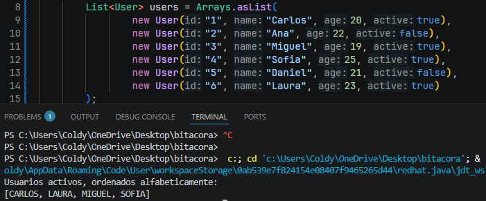

**Explicación:** Usando stream, hacemos el filtrado de usuarios activos con el metodo `filter` y aprovechando la función `isActive` que creamos en usuario. Despues usamos el primer `map()` para transformar los datos de la clase `User` a `String` obteniendo el nombre de los usuarios ya filtrados. Igualmente, usamos el segundo `map()` para transformar los nombres en mayuscula. Despues usamos el metodo `sorted()` para organizar de manera alfabetica (no es necesario escribir un comparador como argumento, ya que por defecto usa el orden alfabetico). Por ultimo, usamos el metood `toList()` para dejar todo en una lista.

## Ejercicio 04 - Personas mayores de edad

Dado un listado de Usuarios y utilizando los mismo atributos anteriores, filtrar las personas mayores de edad y obtener sus nombres. 

**Código implementado:**
```
public class Ejercicio4 {
    public static void main(String[] args) {
        List<User> users = Arrays.asList(
                new User("1", "Carlos", 20, true),
                new User("2", "Ana", 13, false),
                new User("3", "Miguel", 19, true),
                new User("4", "Sofia", 25, true),
                new User("5", "Daniel", 11, false),
                new User("6", "Laura", 16, true)
        );
        List<String> adultsUsers = users.stream()
                                        .filter(u -> u.getAge() > 18)
                                        .map(User::getName)
                                        .toList();
        System.out.println("Usuarios mayores de edad: ");
        System.out.println(adultsUsers);
    }
}
```
**Captura de ejecucion:**

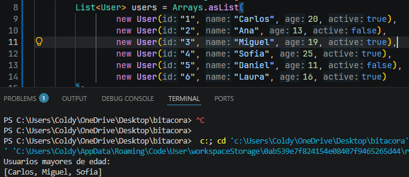

**Explicación:** Usando stream, hacemos el filtrado de usuarios mayores de edad con el metodo `filter` con la condición `u -> u.getAge() > 18`. Despues usamos `map()` para transformar los datos de la clase `User` a `String` obteniendo el nombre de los usuarios ya filtrados. Por ultimo, usamos el metood `toList()` para dejar todo en una lista.

## Ejercicio 05 - Transacciones Bancarias

Dada una lista de transacciones bancarias representadas por objetos: 

`class Transaction { String id; double amount; boolean approved; }`
Se requiere procesar la lista usando Streams para: 

- Usar peek para ver cada transacción procesada (Utilizar System.out.println para ver la transacción) 
- Verificar si existe al menos una transacción no aprobada 
- Retornar true o false indicando si el lote de transacciones es válido. 

**Código implementado:**
```
public class Reto5 {
    public static void main(String[] args) {
        List<Transaction> transactions = Arrays.asList(
                new Transaction("T001", 500000, true),
                new Transaction("T002", 250000, true),
                new Transaction("T003", 800000, false),
                new Transaction("T004", 150000, true)
        );
        boolean loteValido = transactions.stream()
                                         .peek(transaction -> System.out.println("Procesando: " + transaction))
                                         .anyMatch(transaction ->!transaction.isApproved());
                                         
        System.out.println("\n¿El lote es válido? " + !loteValido);
    }
}
```
**Captura de ejecucion:**

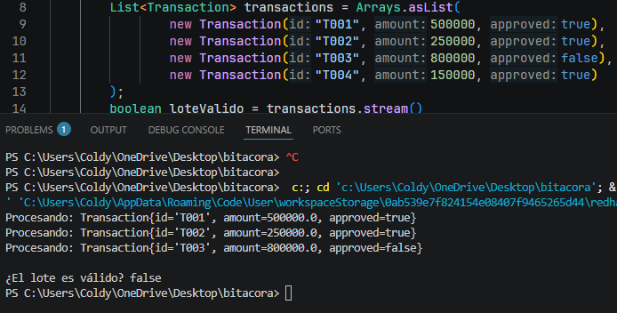

**Explicación:** Usando stream, hacemos la revision de cada transacción con el metodo `peek()` y haciendo un override a la clase `Transaction` para poder ver la información de mejor manera. Despues usamos el metodo `anymatch()` para verificar si existe al menos una transacción no aprobada. Y en el mensaje final invertimos el resultado del anymatch porque se tuvo en cuenta que el lote de transacciones es valido si todas las transacciones fueron aprobadas.


# SEMANA No 2 - Bitácora Pokémon

## Datos de Entrenador:
- Nombre y Apellido: Juan Garzón
- Código de Estudiante: 1000103731
- Curso: DOSW - 4

---

### Ejercicio 01 - Pokémon Tipo Fuego

Dada una lista de Pokémon con nombre y tipo, obtener únicamente aquellos cuyo tipo sea Fuego.

**Código implementado:** 

```
public class Ejercicio1 {
    public static void main(String[] args) {
        List<Pokemon> pokemons = List.of(new Pokemon("Pikachu","Eléctrico"), new Pokemon("Charmander", "Fuego"), new Pokemon("Squirtle", "Agua"), new Pokemon("Vulpix", "Fuego"), new Pokemon("Bulbasaur", "Planta"), new Pokemon("Flareon", "Fuego"));
        List<String> resultado = pokemons.stream()
                                         .filter(p -> p.getTipo().equals("Fuego"))
                                         .map(Pokemon::getNombre) //Necesario para poder obtener el nombre de los pokemons
                                         .toList();
        System.out.println(resultado);    
    }
}
```

**Captura de ejecución:**

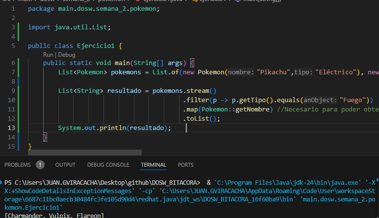

**Explicación:** Realizamos el filtrado de los pokemones tipo Fuego usando el metodo `filter()` y llamando al metodo `getTipo()`. Y usamos un `map()` para poder transformar de clase Pokemon a clase String y poder guardarlos en la lista.

### Ejercicio 02 - Pokédex Gritona

Transformar todos los nombres de Pokémon a mayúsculas.

**Código implementado:**

```
public class Ejercicio2 {
    public static void main(String[] args) {
        List<String> nombres = List.of("Pikachu", "Charmander", "Squirtle", "Bulbasaur" );
        List<String> resultado = nombres.stream()
                                        .map(String::toUpperCase)
                                        .toList();
        System.out.println(resultado);
    }
}
```

**Captura de ejecución:**

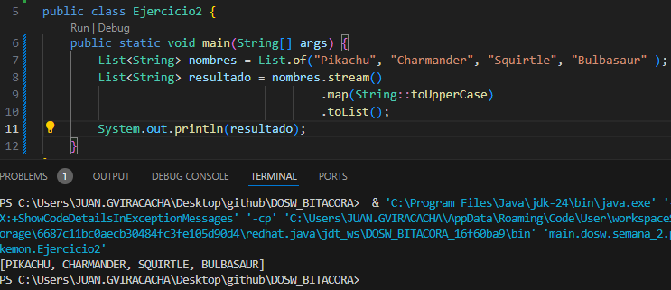

**Explicación:** Usando el metodo `map()` de los streams, podemos transformar la lista de nombres a mayusculas con el metodo `toUpperCase()` que tiene integrado la clase String.

### Ejercicio 03 - Poder Total del Equipo

Dada una lista de niveles de Pokémon, calcular la suma total de niveles del equipo. 

**Código implementado:**

```
public class Ejercicio3 {
    public static void main(String[] args) {
        List<Integer> niveles = List.of(45, 62, 38, 71, 55, 29);
        int resultado = niveles.stream().reduce(0, Integer::sum);
        System.out.println(resultado);
    }
}
```

**Captura de ejecución:**

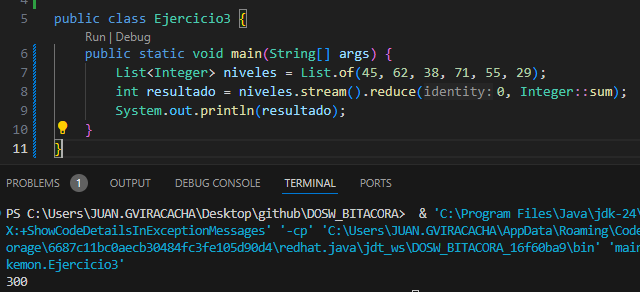

**Explicación:** Usando el metodo `reduce()` para sumar los elementos de la lista de niveles, y utilizando azucar sintactico podemos reducir la expresión a `Integer::sum`.

### Ejercicio 04 - Pokémon Alfa

Encontrar el Pokémon con el nivel más alto dentro del equipo.

**Código implementado:**

```
public class Ejercicio4 {
    public static void main(String[] args) {
        List<Pokemon> pokemons = List.of(new Pokemon("Pikachu", null, 45), new Pokemon("Charmander", null, 62), new Pokemon("Squirtle", null, 32), new Pokemon("Snorlax", null, 90), new Pokemon("Mewtwo", null, 88));
        Pokemon resultado = pokemons.stream().max(Comparator.comparingInt(Pokemon::getNivel)).orElse(null);
        System.out.println("Pokémon Alfa: " + resultado.getNombre() + " (nivel " + resultado.getNivel() + ")");
    }
}

```

**Captura de ejecución:**

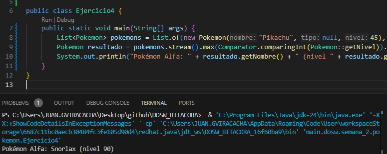

**Explicación:** Usando el metodo `max()` de streams y un `Comparator` podemos comparar todos los pokemons de la lista por su nivel. Y resultara un pokemon el cual tiene el nivel mas alto.

### Ejercicio 05 - Pokémon Legendarios

Contar cuántos Pokémon del equipo tienen nivel superior a 80.

**Código implementado:**

```
public class Ejercicio5 {
    public static void main(String[] args) {
        List<Pokemon> pokemons = List.of(new Pokemon("Pikachu", null, 45), new Pokemon("Mewtwo", null, 88), new Pokemon("Dragonite", null, 82), new Pokemon("Squirtle", null, 38), new Pokemon("Mew", null, 85), new Pokemon("Charmander", null, 62));
        long resultado = pokemons.stream()
                             .filter(p -> p.getNivel() > 80)
                             .count();
        System.out.println("Pokémon con nivel > 80: " + resultado);
    }
}
```

**Captura de ejecución:**

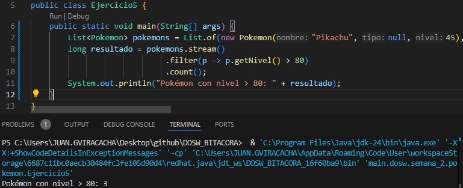

**Explicación:** Primero realizamos el filtrado de los pokemons con el metodo `filter()` para verificar que pokemons tienen nivel superior a 80. Y realizamos un `count()` posterior a ese filtrado.

### Ejercicio 06 - Pokédex Sin duplicados

Dada una lista de Pokémon con elementos repetidos, generar una nueva colección donde cada Pokémon aparezca una sola vez. 

**Código implementado:**

```
public class Ejercicio6 {
    public static void main(String[] args) {
        List<String> pokemons = List.of("Pikachu","Charmander","Pikachu","Squirtle","Charmander","Mewtwo");
        List<String> resultado = pokemons.stream().distinct().toList();
        System.out.println(resultado);
    }
}
```

**Captura de ejecución:**


**Explicación:** Usamos el metodo `distinct()` de los streams, para eliminar los elementos repetidos y el `toList()` para generar la nueva colección donde cada Pokemón aparece una sola vez.

### Ejercicio 07 - Orden del Profesor Oak

El Profesor Oak quiere su Pokédex organizada. Ordenar alfabéticamente los nombres de los Pokémon.

**Código implementado:**

```
public class Ejercicio7 {
    public static void main(String[] args) {
        List<String> pokemons = List.of("Squirtle","Pikachu","Mewtwo","Bulbasaur","Charmander","Abra");
        List<String> pokemonsOrdenado = pokemons.stream().sorted().toList();
        System.out.println(pokemonsOrdenado);
    }
}
```
**Captura de ejecución:**

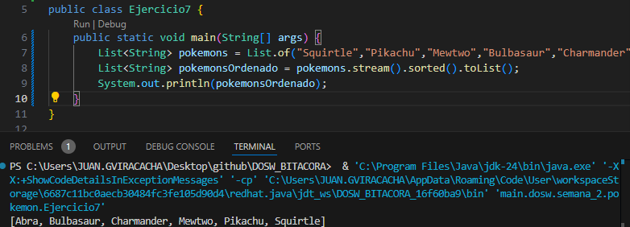

**Explicación:** Utilizando el metodo `sorted()` podemos ordenar de manera alfabetica la Pokédex del Profesor Oak. (No es necesario un argumento en `sorted()` ya que por defecto organiza en orden alfabetico).

### Ejercicio 08 - Evoluciones Preparadas

Dada una lista de Pokémon que incluye si pueden evolucionar (boolean puedeEvolucionar), obtener únicamente los que estén listos para evolucionar. 

**Código implementado:** 

```
public class Ejercicio8 {
    public static void main(String[] args) {
        List<Pokemon> pokemons = List.of(new Pokemon("Pikachu", true), new Pokemon("Raichu", false), new Pokemon("Charmander", true), new Pokemon("Charizard", false), new Pokemon("Squirtle", true), new Pokemon("Blastoise", false));
        List<Pokemon> listaEvolucion = pokemons.stream().filter(p -> p.puedeEvolucionar()).toList();
        System.out.println("Listos para evolucionar:");
        System.out.print(listaEvolucion);
    }
}
```
**Captura de ejecución:**

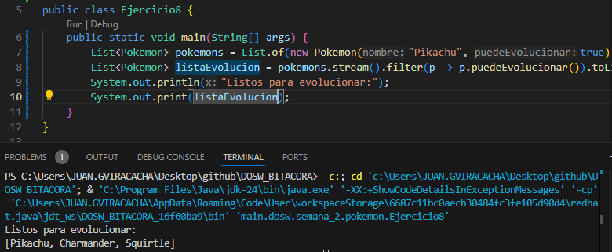

**Explicación:** Usamos el metodo `filter()` para filtrar los Pokémon que esten listos para evolucionar, utilizando el metodo implementado de la clase Pokemon: `puedeEvolucionar()`.

### Ejercicio 09 - Equipo Élite

Mostrar únicamente los Pokémon cuyo poderCombate sea superior a 500. 

**Código implementado:** 

```
public class Ejercicio9 {
    public static void main(String[] args) {
        List<Pokemon> pokemons = List.of(
            new Pokemon(1,"Pikachu", "Eléctrico", 0, 320, "", false),
            new Pokemon(2,"Mewtwo", "Psíquico", 0, 680, "", false),
            new Pokemon(3,"Dragonite", "Dragon-Volador", 0, 530, "", false),
            new Pokemon(4,"Squirtle", "Agua", 0, 210, "", false),
            new Pokemon(5,"Gengar", "Fantasma-Veneno", 0, 495, "", false),
            new Pokemon(6,"Charizard", "Fuego-Volador", 0, 610, "", false)
        );
        List<Pokemon> equipoElite = pokemons.stream().filter(p->p.getPoderCombate()>500).toList();
        System.out.println("Equipo Élite (PC > 500): ");
        System.out.println(equipoElite);
    }
}
```

**Captura de ejecución:** 

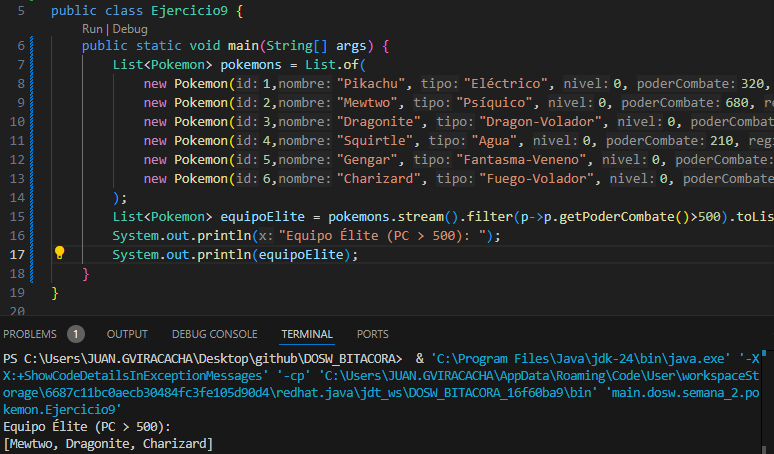

**Explicación:** Usando el metodo `filter()` podemos filtrar de nuestra lista de Pokémon por poder de combate cuando es superior a 500.

### Ejercicio 10 - Pokédex Compacta

Generar una lista que contenga únicamente los nombres de todos los Pokémon del equipo.

**Código implementado:**

```
public class Ejercicio10 {
    public static void main(String[] args) {
        List<Pokemon> pokemons = List.of(
            new Pokemon(1,"Pikachu", "Eléctrico", 0, 320, "", false),
            new Pokemon(2,"Mewtwo", "Psíquico", 0, 680, "", false),
            new Pokemon(3,"Dragonite", "Dragon-Volador", 0, 530, "", false),
            new Pokemon(4,"Squirtle", "Agua", 0, 210, "", false),
            new Pokemon(5,"Gengar", "Fantasma-Veneno", 0, 495, "", false),
            new Pokemon(6,"Charizard", "Fuego-Volador", 0, 610, "", false)
        );
        List<String> nombresPokemon = pokemons.stream()
                                              .map(Pokemon::getNombre)
                                              .collect(Collectors.toList());
        System.out.println(nombresPokemon);
    }
}
```

**Captura de ejecución:**

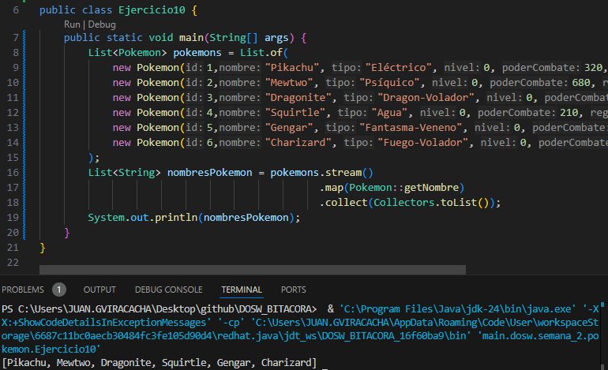

**Explicación:** Usando el metodo `map()` podemos transforar los pokemons de clase Pokemon a String, y usando un `collect()` generamos una lista que contenga solo los nombres.

### Ejercicio 11 - Poder Promedio

Calcular el promedio de poderCombate de todos los Pokémon del equipo.

**Código implementado:** 

```
public class Ejercicio11 {
    public static void main(String[] args) {
        List<Pokemon> pokemons = List.of(
            new Pokemon(1,"Pikachu", "Eléctrico", 0, 320, "", false),
            new Pokemon(2,"Mewtwo", "Psíquico", 0, 680, "", false),
            new Pokemon(3,"Dragonite", "Dragon-Volador", 0, 530, "", false),
            new Pokemon(4,"Squirtle", "Agua", 0, 210, "", false),
            new Pokemon(5,"Gengar", "Fantasma-Veneno", 0, 495, "", false),
            new Pokemon(6,"Charizard", "Fuego-Volador", 0, 610, "", false)
        );
        double promedioPoderCombate = pokemons.stream()
                                              .mapToDouble(Pokemon::getPoderCombate)
                                              .average()
                                              .orElse(0.0);
        System.out.println("Poder de combate promedio: " + promedioPoderCombate);
    }
}
```

**Captura de ejecución:** 

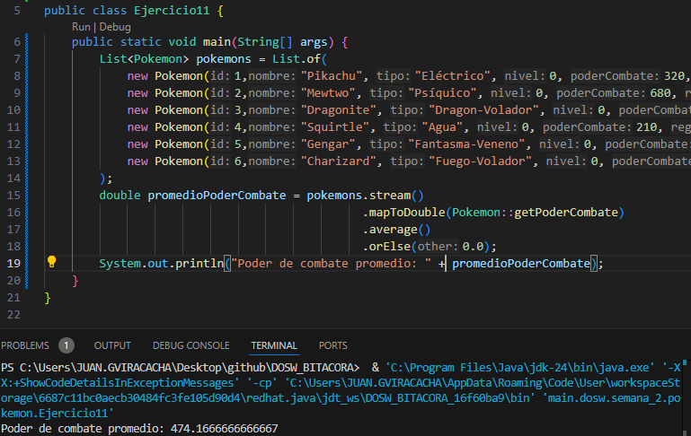

**Explicación:** Usando el metodo `mapToDouble()` (que esta especializado para trabajar con los datos primitivos double), obtenemos el poderCombate de cada Pokémon. Con el metodo `average()` calculamos automaticamente el promedio del poderCombate (es necesario agregar el `orElse()` para que sepa que valor tomar en caso que la lista este vacia).

### Ejercicio 12 - Campeón Regional

Obtener el Pokémon con mayor poderCombate de toda la lista.

**Código implementado:**

```
public class Ejercicio12 {
    public static void main(String[] args) {
        List<Pokemon> pokemons = List.of(
            new Pokemon(1,"Pikachu", "Eléctrico", 0, 320, "", false),
            new Pokemon(2,"Mewtwo", "Psíquico", 0, 680, "", false),
            new Pokemon(3,"Dragonite", "Dragon-Volador", 0, 530, "", false),
            new Pokemon(4,"Charizard", "Fuego-Volador", 0, 610, "", false)
        );
        Pokemon pokemonMayorPoderCombate = pokemons.stream()
                                                   .max(Comparator.comparing(Pokemon::getPoderCombate))
                                                   .orElse(null);
        System.out.println("Campeón: "+ pokemonMayorPoderCombate + " con PC: " + pokemonMayorPoderCombate.getPoderCombate());
    }
}
```

**Captura de ejecución:** 

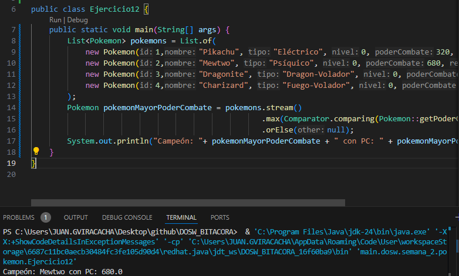

**Explicación:** Usando el metodo `max()` podemos saber cuál es el Pokémon con mayor poderCombate, utilizando tambien el comparador `comparing(Pokemon::getPoderCombate)` para obtener el poderCombate de los Pokémon.

### Ejercicio 13 - Organizar por Tipo

Agrupar todos los Pokémon por su tipo y mostrar el listado por grupo.

**Código implementado:**

```
public class Ejercicio13 {
    public static void main(String[] args) {
        List<Pokemon> pokemons = List.of(
            new Pokemon(1,"Squirtle", "Agua", 0, 210, "", false),
            new Pokemon(2,"Psyduck", "Agua", 0, 0, "", false),
            new Pokemon(3,"Charizard", "Fuego", 0, 610, "", false),
            new Pokemon(4,"Vulpix", "Fuego", 0, 0, "", false),
            new Pokemon(5,"Bulbasaur", "Planta", 0, 0, "", false)
        );
        Map<String, List<Pokemon>> agrupadosPorTipo = pokemons.stream().collect(Collectors.groupingBy(Pokemon::getTipo)); //Version alterna para guardar solo strings: Map<String, List<String>> agrupadosPorTipo = pokemones.stream().collect(Collectors.groupingBy(Pokemon::getTipo, Collectors.mapping(Pokemon::getNombre, Collectors.toList())));
        System.out.println(agrupadosPorTipo);
    }
}
```

**Captura de ejecución:**

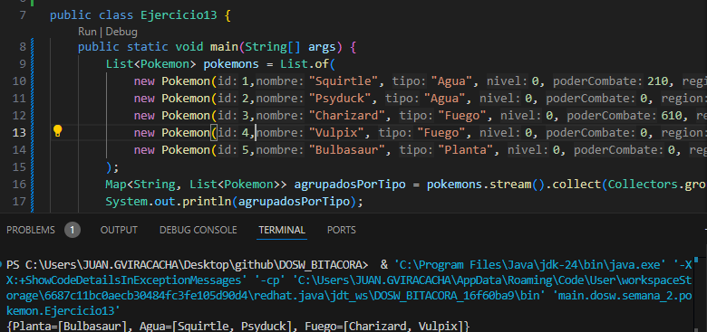

**Explicación:** Para poder implementar el metodo `groupingBy()` debe estar primero un `collect(Collectors.groupingBy)` y como argumento podemos definir el tipo de los Pokémon y este hará la agrupación por defecto.

### Ejercicio 14 - Organizar por Región

Agrupar los Pokémon según su región de origen.

**Código implementado:**

```
public class Ejercicio14 {
    public static void main(String[] args) {
        List<Pokemon> pokemons = List.of(
            new Pokemon(1,"Pikachu", "Eléctrico", 0, 320, "Kanto", false),
            new Pokemon(2,"Chikorita", "Planta", 0, 680, "Johto", false),
            new Pokemon(3,"Torchic", "Fuego", 0, 530, "Hoenn", false),
            new Pokemon(4,"Piplup", "Agua", 0, 210, "Sinnoh", false),
            new Pokemon(5,"Charmander", "Fuego", 0, 495, "Kanto", false),
            new Pokemon(6,"Totodile", "Agua", 0, 610, "Johto", false)
        );
        Map<String, List<Pokemon>> agrupadoPorRegion = pokemons.stream().collect(Collectors.groupingBy(Pokemon::getRegion));
        System.out.println(agrupadoPorRegion);
    }
}

```

**Captura de ejecución:**

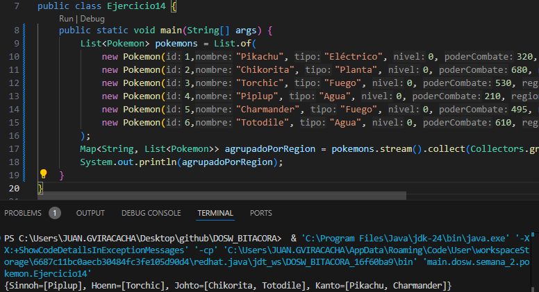

**Explicación:** Para poder implementar el metodo `groupingBy()` debe estar primero un `collect(Collectors.groupingBy)` y como argumento podemos definir la región de los Pokémon y este hará la agrupación por defecto.

### Ejercicio 15 - Maestro de Gimnasios

Dado un listado de entrenadores con sus medallas, encontrar el entrenador con más medallas.

**Código implementado:** 

```
public class Ejercicio15 {
    public static void main(String[] args) {
        List<Entrenador> entrenadores = List.of(
            new Entrenador((long) 1, "Ash", 8, null),
            new Entrenador((long) 2, "Misty", 5, null),
            new Entrenador((long) 3, "Brock", 6, null),
            new Entrenador((long) 4, "Gary", 10, null)
        );
        Entrenador maestroGimnasios = entrenadores.stream()
                                                  .max(Comparator.comparing(Entrenador::getMedallas))
                                                  .orElse(null);
        System.out.println("Campeón de gimnasios: " + maestroGimnasios.getNombre());
        System.out.println("Medallas obtenidas: " + maestroGimnasios.getMedallas());
    }
}
```

**Captura de ejecución:**

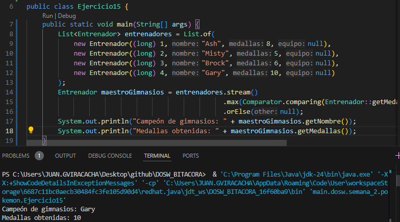

**Explicación:** Usando el metodo `max()` podemos saber cuál es el Entrenador con más medallas, utilizando tambien el comparador `comparing(Entrenador::getMedallas)` para poder comparar a los entrenadores por medallas

### Ejercicio 16 - Entrenadores Experimentados

Mostrar únicamente los entrenadores que posean más de 5 medallas.

**Código implementado:**
```
public class Ejercicio16 {
    public static void main(String[] args) {
        List<Entrenador> entrenadores = List.of(
            new Entrenador((long) 1, "Ash", 8, null),
            new Entrenador((long) 2, "Misty", 5, null),
            new Entrenador((long) 3, "Brock", 6, null),
            new Entrenador((long) 4, "Gary", 10, null),
            new Entrenador((long) 5, "May", 3, null),
            new Entrenador((long) 6, "Dawn", 7, null)
        );
        List<Entrenador> entrenadoresExperimentados = entrenadores.stream()
                                                                  .filter(p -> p.getMedallas() > 5)
                                                                  .toList();
        System.out.println("Entrenadores con > 5 medallas: ");
        System.out.println(entrenadoresExperimentados);
    }
}

```
**Captura de ejecución:** 

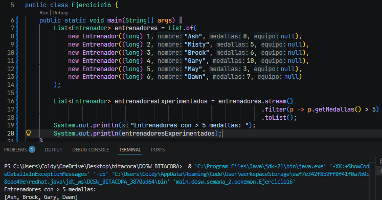

**Explicación:** Utilizando el metodo `filter()` podemos filtrar de nuestra lista de entrenadores con la expresión lambda `p -> p.getMedallas() > 5` para cumplir nuestra condición de mostrar únicamente los entrenadores que posean más de 5 medallas.

### Ejercicio 17 - Equipo Más Poderoso

Calcular cuál entrenador tiene la suma total de poderCombate más alta entre todos sus Pokémon.

**Código implementado:**

```
public class Ejercicio17 {
    public static void main(String[] args) {
        List<Pokemon> equipoAsh = Arrays.asList(
            new Pokemon(1, "Pikachu", "Eléctrico", 50, 850.0, "Kanto", false),
            new Pokemon(2, "Charizard", "Fuego", 60, 1000.0, "Kanto", false)
        );
        List<Pokemon> equipoGary = Arrays.asList(
            new Pokemon(3, "Blastoise", "Agua", 65, 1200.0, "Kanto", false),
            new Pokemon(4, "Arcanine", "Fuego", 58, 1140.0, "Kanto", false)
        );
        List<Pokemon> equipoBrock = Arrays.asList(
            new Pokemon(5, "Onix", "Roca", 45, 750.0, "Kanto", false),
            new Pokemon(6, "Geodude", "Roca", 40, 920.0, "Kanto", false)
        );

        List<Entrenador> entrenadores = List.of(new Entrenador((long) 1, "Ash", 0, equipoAsh), new Entrenador((long) 2, "Gary", 0, equipoGary), new Entrenador((long) 3, "Brock", 0, equipoBrock));

        Entrenador masPoderoso = entrenadores.stream().max(Comparator.comparingDouble(entrenador -> entrenador.getEquipo().stream().mapToDouble(Pokemon::getPoderCombate).sum())).orElse(null);
        double poderTotal = masPoderoso.getEquipo().stream().mapToDouble(Pokemon::getPoderCombate).sum();

        System.out.println("Entrenador más poderoso: " + masPoderoso.getNombre());
        System.out.println("Poder acumulado del equipo: " + poderTotal);
    }
}

```
**Captura de ejecución:** 

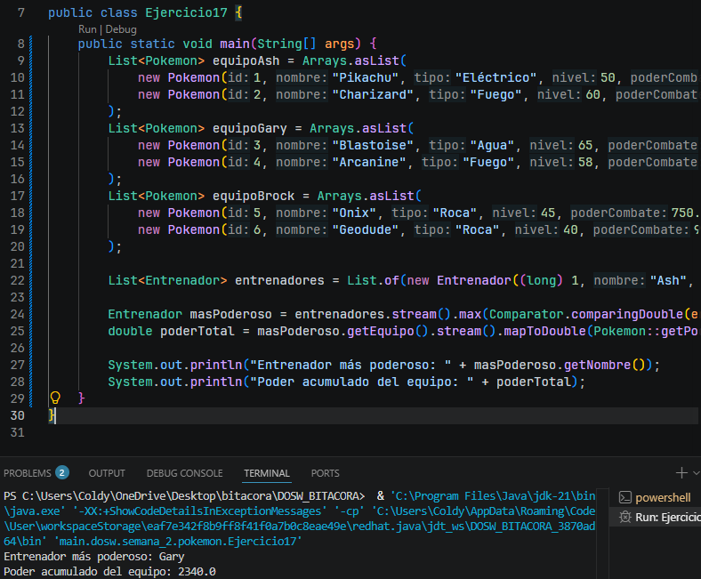

**Explicación:** Al solicitarnos la suma total más alta, el método `max()` en el que como argumento tenemos un comparador que realiza un segundo stream sobre la lista de Pokémon de cada entrenador y poder calcular la suma del poderCombate con los metodos `mapToDouble()` y `sum()`.


### Ejercicio 18 - Top 5 Pókemon Más Fuertes

Generar un ranking de los cinco Pokémon con mayor poderCombate de toda la Pokédex.

**Código implementado:**

```
public class Ejercicio18 {
    public static void main(String[] args) {
        List<Pokemon> pokedex = Arrays.asList(
            new Pokemon(1, "Bulbasaur", "Planta/Veneno", 15, 150.0, "Kanto", false),
            new Pokemon(2, "Charizard", "Fuego/Volador", 65, 610.0, "Kanto", false),
            new Pokemon(3, "`kachu", "Eléctrico", 45, 320.0, "Kanto", false),
            new Pokemon(4, "Rayquaza", "Dragón/Volador", 75, 100.0, "Hoenn", true),
            new Pokemon(5, "Gengar", "Fantasma/Veneno", 58, 495.0, "Kanto", false),
            new Pokemon(6, "Lucario", "Lucha/Acero", 50, 420.0, "Sinnoh", false),
            new Pokemon(7, "Mewtwo", "Psíquico", 70, 680.0, "Kanto", true),
            new Pokemon(8, "Snorlax", "Normal", 55, 460.0, "Kanto", false),
            new Pokemon(9, "Dragonite", "Dragón/Volador", 62, 530.0, "Kanto", false),
            new Pokemon(10, "Gyarados", "Agua/Volador", 60, 480.0, "Kanto", false)
        );
        List<Pokemon> ranking = pokedex.stream()
                                       .sorted(Comparator.comparing(Pokemon::getPoderCombate).reversed())
                                       .limit(5)
                                       .toList();

        IntStream.range(0, ranking.size()).forEach(i -> {
            Pokemon p = ranking.get(i);
            System.out.printf("#%d %-12s - PC: %.0f%n", (i + 1), p.getNombre(), p.getPoderCombate());
        });
    }
}
```

**Captura de ejecución:** 

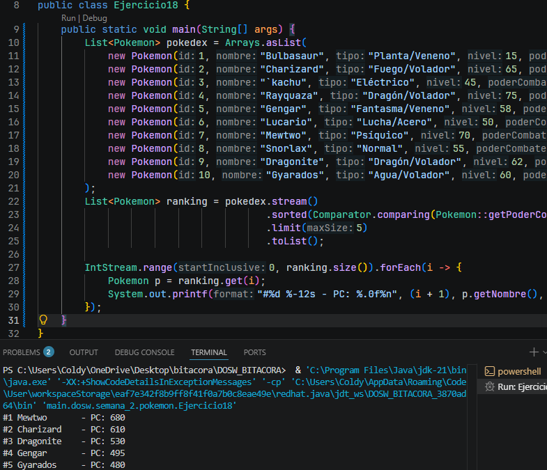

**Explicación:** Utilizando el método `sorted()` y un comparador para poder comparar el poder de combate de cada Pokémon, además aplicamos un `reversed()` para que el ordenamiento lo haga de manera descendente. Agregamos un `limit(5)` para limitar el resultado a los primeros 5 Pokémon

### Ejercicio 19 - Nombre del Ejercicio

Enunciado del Ejercicio

**Código implementado:** (pegar el código aquí)
**Captura de ejecución:** (imagen)
**Explicación:** (breve descripción)

### Ejercicio 20 - Nombre del Ejercicio

Enunciado del Ejercicio

**Código implementado:** (pegar el código aquí)
**Captura de ejecución:** (imagen)
**Explicación:** (breve descripción)